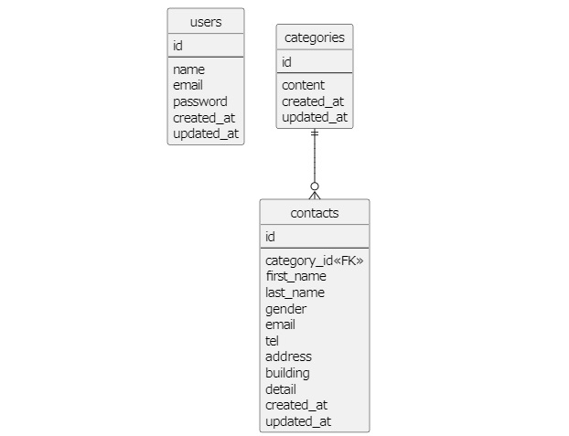

## アプリケーション名
contact-form

## 環境構築
\$ docker-compose up -d  
\$ docker-compose exec php bash  
\# composer install  

.envファイルを作成し、以下のように修正する  
    DB_HOST=mysql  
    DB_DATABASE=laravel_db  
    DB_USERNAME=laravel_user  
    DB_PASSWORD=laravel_pass 

\# art key:generate  
\# art migrate  
\# art db:seed  
ブラウザでhttp://localhost/にアクセス

※storageでの権限エラーが出た場合は以下のコマンドを実行  
\$ cd src  
\$ sudo chmod 777 -R storage  

## 使用技術(実行環境)
Laravel Framework 8.83.8  
Composer version 2.7.9  
PHP version 7.4.9  
nginx 1.21.1  
mysql 8.0.26  

## ER図

## URL
http://localhost/